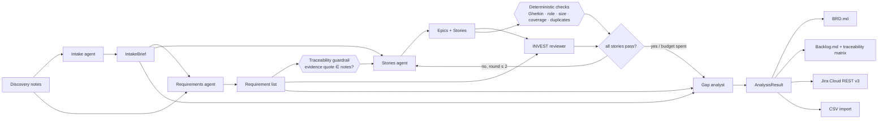

# Architecture

## The pipeline

## Why five agents and not one prompt

A single "turn these notes into stories" prompt works on a demo and fails on
a real transcript, for three reasons the split addresses:

| Problem with one big prompt | What the split does about it |
|---|---|
| The model invents requirements that sound right for the domain but were never said | The **requirements agent** must quote its evidence verbatim, and a **string-matching guardrail** (not the model) checks that the quote exists in the notes. Untraceable requirements are flagged, not dropped. |
| Story quality drifts — vague roles, untestable criteria, epics in disguise | A separate **reviewer** scores INVEST per story with a hard pass rule, and **only failing stories** go back to the writer with the reviewer's feedback. Bounded to 2 rounds. |
| The writer pads scope by re-reading the transcript | The **stories agent never sees the notes** — only the approved requirement list. Every story must cite requirement ids, and coverage of must/should requirements is checked deterministically. |

## Context engineering, concretely

Each agent's user message is assembled in `agents/__init__.py::render_user`
from tagged blocks. What each agent sees:

| Agent | Sees | Does **not** see |
|---|---|---|
| intake | `<notes>` | — |
| requirements | `<brief>`, `<notes>` | — |
| stories | `<context>` (title, domain, goals), `<requirements>` (compact, one line each); on revision also `<stories_to_revise>`, `<reviewer_feedback>` | raw notes, previous reviews of passing stories |
| review | `<requirements>` (id: statement), `<stories>` | notes, brief |
| gaps | `<brief>`, `<requirements>`, `<backlog_summary>` (id, req ids, title) | full story text, notes |

The system prompt is `prompts/<version>/<agent>.md` plus the Pydantic JSON
schema of the expected output. A response that fails schema validation is sent
back once with the exact validation errors (`<validation_errors>`); a second
failure aborts the run with a clear error rather than passing bad data on.

## Guardrails are code, not prompts

`storyforge/guardrails/__init__.py`

- `trace_score(evidence, notes)` — 1.0 for a verbatim (whitespace/case
  normalised) substring, else best fuzzy ratio over a sliding window.
  Threshold 0.82. A paraphrase scores ~0.85–0.95; an invention scores < 0.6.
- `gherkin_issues(story)` — each Given/When/Then part present and non-trivial;
  `then` must contain an observable-outcome verb or a number and must not use
  "works", "correctly", "properly", "as expected".
- `story_issues(story)` — role is not the bare word "user"; `i_want` ≤ 30 words
  and not an and/or chain; `so_that` present; requirement ids exist.
- `check_backlog` — every must/should requirement has ≥ 1 story.
- `duplicate_pairs` — near-identical `as_a + i_want` (ratio ≥ 0.86).

The reviewer LLM adds judgement (value, negotiability, whether the criteria
actually test the requirement). The two are combined: a story passes only if
the model says pass **and** every INVEST score ≥ 3 **and** the deterministic
checks are clean.

## Providers

`llm/router.py` tries providers in order (`STORYFORGE_BACKEND=groq,gemini`),
retrying on 429 with backoff and falling through on other errors. Each client
is ~50 lines of `httpx` against the vendor's REST endpoint with JSON mode
enabled — no SDKs. `stub` is an offline heuristic backend that keeps the
tests, CI and UI demo runnable without keys.

## Surfaces

- `api.py` — FastAPI: `/api/analyze`, `/api/publish`, `/api/export`, `/api/health`, `/api/examples`, and `/` serving `web/index.html`.
- `cli.py` — `python -m storyforge.cli notes.txt --out out/ [--publish [--dry-run]]`.
- `publishers/jira.py` — Jira Cloud REST v3. Epics first, then stories with
  `parent` set to the epic key; descriptions in Atlassian Document Format;
  idempotent by `label + summary`; dry-run returns the exact request bodies.
- `publishers/markdown.py` — BRD, backlog with traceability matrix, Jira CSV.

## Evaluation

`eval/run_eval.py` runs the golden set (`eval/golden/*.json`, 8 domains,
83 labelled requirements, 16 distractor sentences) through the pipeline and
scores it deterministically. See `eval/DECISIONS.md` for the numbers and what
changed between prompt versions.
